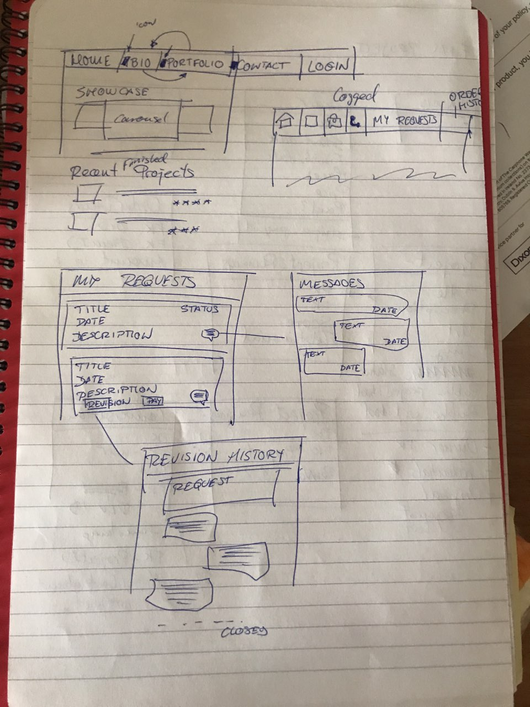
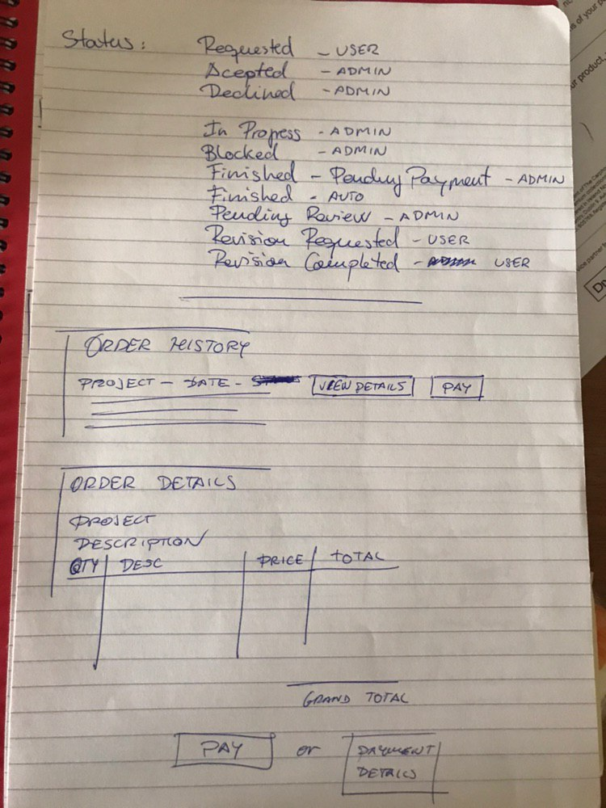
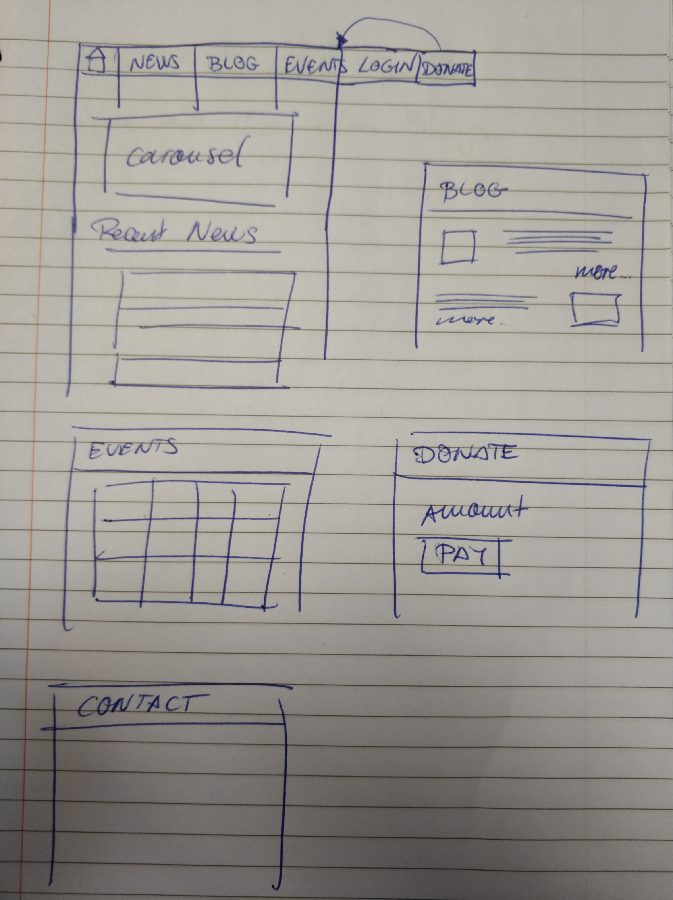
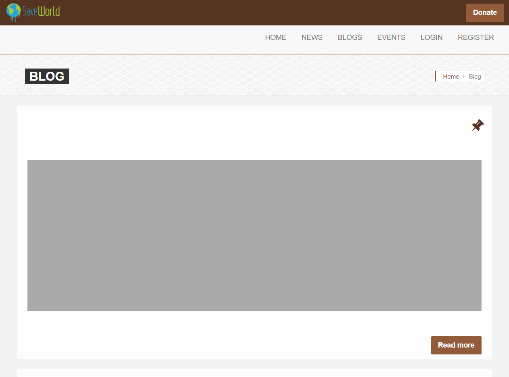

# Save The World

There's enough scientific fact that the climate is deteriorating at an exponential rate. This sentiment is not, however, shared with other people in the world neither governments so it is the job of individuals and some non-profit organizations to help spread the information so the humans can survive their own doomsday clock.
As not many organizations have the funding to pay for a customize website, Save The World app can be used to have a ready to deploy solution to cover most of their needs including spread information, putting people in contact of other people, and get funding for activities.

## External user’s goal

Users will be able to contribute to a non profit organization by checking their event calendar or contributing to information or details on the site.

## Site owner's goal

- Spread awareness of problems that require the masses involvement.
- Offer users to make donations to a worthy cause.
- Promote contribution and colaboration among users

## Features

### Stakeholders

- Visitor: A regular user of the website, may or may not be already involved with the organization.
- Contributor: An user that is part of the organization and have elevated privileges that allow them some access to the backend of the site.
- Admin: The owner of the site and/or organization, with full access to users, permissions and configuration of the site.

### Must Haves

- As a Contributor, I would like to publish News or Blog posts so I can inform our Visitors of the activities the organization is involved with.
- As a Contributor, I would like to add events to a calendar so my users can organize themselves beforehand and make time for our organization's events.
- As a Visitor, I would like to be able to access all the information with a regular website navigation so I don't have to use the keyboard or browser's menu to do so. The website should be available in mobile and desktop, with focus in mobile.
- As a Visitor, I would like to be able to make donations to the organization without being registered so I don't have to create an account to give out money.
- As an Admin, I would like to be able to review users configuration and permissions so I can promote my registered users to Contributors or Admins.
- As a User, I would like to be able to read and write comments in any news or blog posts so I can interact with other users of the site.

### Could Haves

- As a Visitor, I would like to be able to access my donations history so I can use this information to fill out my tax returns.
- As a User, I would like to be able to add Mentions to my comments so I can notify other users of news or information that may interest them.
- As a User, I would like to receive visual notifications whenever I have a mention so I can quickly see the information that others believe it's on my interest.
- As a User, I would like to be able to share in Social Media posts I consider relevant to raise awareness of others.
- As a User, I would like to be able to send private messages to others so I can avoid using third party applications to communicate with people that share similar interests than me.
- As a User, I can upload my own profile picture without administrator intervention so I can allow others to see my style and profile.

### Out of Scope (Won't haves)

- The applications won't have moderation tools at this point. The admin user can delete a post or conversation from the backend directly if deemed inappropriate.
- Event signup won't be included at this point. The calendar and comments would help organize the event publicly. A contact email or phone would be shared if users need more information about a specific event.

## UX

### Initial mockups

### Brand Design and Palette

[Paletton file](docs/paletton.html)

## Technologies Used

- [django](https://www.djangoproject.com/)
  - The project has been built with the **django** framework which provides, out of the box, authentication, routing, security and templating. It is based on the **Python** programming language and also benefits from the opensource community to grow in functionality and code reviews.
- [JQuery](https://jquery.com)
  - The project uses **JQuery** to simplify DOM manipulation.
- [Bootstrap](https://getbootstrap.com/)
  - The project uses **Bootstrap** to create a responsive grid system to organize content in the website and as a base for other custom CSS styles.
- [Google Calendar](https://calendar.google.com/)
  - The project uses **Google Calendar** to to provide the users of day and time for events planned by the administrators and organizers.
- [Stripe](https://stripe.com/)
  - The project implements **Stripe Payments** to allow users to process payments over the platform.
- [Heroku](https://www.heroku.com/)
  - The project has been deployed to the **Heroku** platform that provides automatic deploys, as well as a Postgres database.
- [Travis](https://travis-ci.com/)
  - The project uses **Travis CI** for Continuous Integration so the project can be tested before going into deployment.

## Testing

This project does not include testing automation as most of the business logic is just data handling that is automatically performed by the django framework. Automating user actions and UI is better to be handled with the visual cues of a real human therefore all testing has been performed as outlined in the Manual Testing steps below.

### Manual Testing

A [detailed Test Plan](docs/test-cases.md) can be found in the following [link](docs/test-cases.md)

### Browser Compatibility

The application should be compatible with the latest versions in all browsers thanks to the use of polyfills. There are some fields that behave erratically in Internet Explorer but the application is functional despite these graphic issues

| Vendor            | Version        | Compatibility status                           |
| ----------------- | -------------- | ---------------------------------------------- |
| Google Chrome     | 77.0.3865.90   | Fully Compatible                               |
| Mozilla Firefox   | 69.0.1         | Fully Compatible                               |
| Microsoft Edge    | 44.17763.1.0   | Fully Compatible                               |
| Internet Explorer | 11.737.17763.0 | Functional, with some visual errors due to CSS |

## Deployment

The project has been deployed to Heroku using Github and Travis as pipeline. In order to make it work the following environment variables must be defined:

- SECRET_KEY
- STRIPE_PUBLISHABLE
- STRIPE_SECRET
- CURRENT_HOST
- EMAIL_ADDRESS
- EMAIL_PASSWORD
- DATABASE_URL
- AWS_ACCESS_KEY_ID
- AWS_SECRET_ACCESS_KEY

In local, an env.py file was created that includes calls to os.environ.setdefault() to set up these, but this file has not been submitted to Github.
In Heroku, these variables are provided as part of the environment variables the platform allows you to configure.

## Credits

### Content

- The Accounts and Post apps were adapted as part of the learning material from the [Full Stack Developer Diploma by Code Institute](https://codeinstitute.net/full-stack-software-development-diploma/).
- Logo, favicon and brand design colours provided by freelancer Tabish Ali

### Media

- The pictures from the website have been taken from Cork Nature Network website: [Cork Nature Network Website](https://corknaturenetwork.ie/)

### Acknowledgements

- I received inspiration for this project from the chaos that humanity is causing to the planet. Remember, the planet will endure, as it has endured 5 previous mass extinctions. The ones that won't probably survive is the human race, so we're really not "saving the planet" but "saving ourselves".

\*\*\*End of transmission
